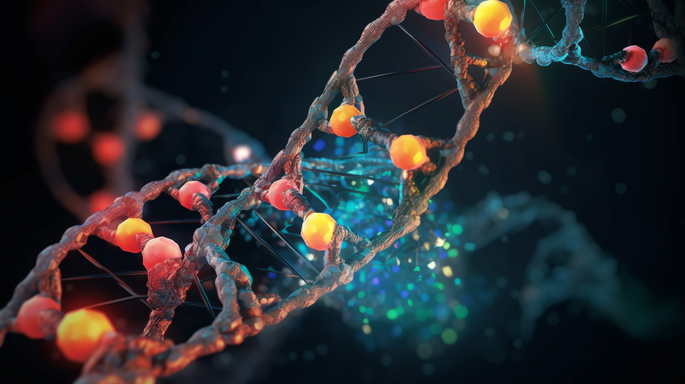

<!-- PROJECT SHIELDS -->
<!--
*** I'm using markdown "reference style" links for readability.
*** Reference links are enclosed in brackets [ ] instead of parentheses ( ).
*** See the bottom of this document for the declaration of the reference variables
*** for contributors-url, forks-url, etc. This is an optional, concise syntax you may use.
*** https://www.markdownguide.org/basic-syntax/#reference-style-links
-->

<!-- PROJECT LOGO -->
 

  

<h3 align="center">DEEP-PPI</h3>

  

    Protein-Protein Interaction using deep learning models 
     
  

<!-- ABOUT THE PROJECT -->
## About The Project

This project aims to develop and train deep learning models to predict the interaction of proteins by using protein sequences as inputs. 
The goal is to provide accurate predictions that can be used to study the complex interactions between proteins. 
The models are based on large Language Models as encoders.
If you find this reseach interesting and have questions please reach out to me (e.g. through github issues).

## Getting Started

This project is basd on Python 3.11 and built using [Poetry](https://python-poetry.org/)].
### Prerequisites

Please install Poetry and clone the github repository. Poetry will handle the creation of a vitual enviroment and the installation of all dependencies.

### Installation

Coming soon

## Usage

Coming soon

## Acknowledgments

